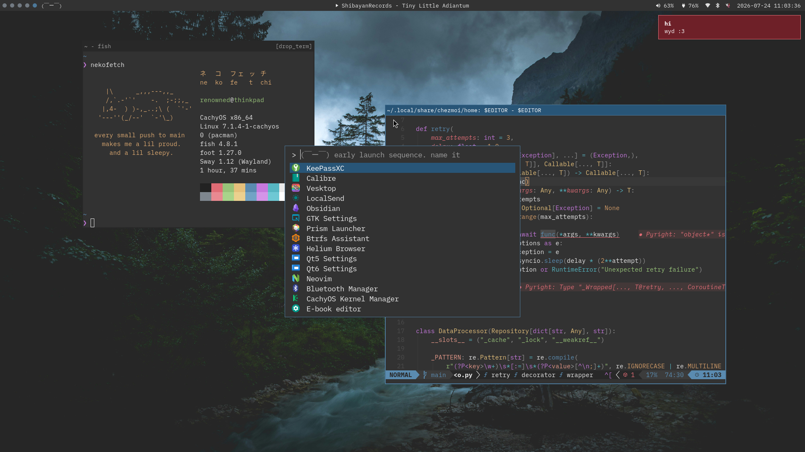
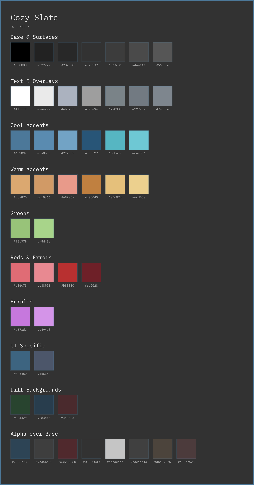

# dotfiles

My personal dotfiles, managed with [chezmoi](https://www.chezmoi.io/).

This is the setup I daily drive on CachyOS with Sway as the centerpiece. It is not meant to be a universal template. The desktop has a small Tamagotchi-like mood system. It reacts to battery state, CPU load, and time of day, and communicates in kaomoji.

The cat is elsewhere. Who knows where it went.

Feel free to look around and copy anything useful.

<p align="center">
  <br><br>
  
</p>

## Assumptions

- Arch Linux (CachyOS preferred)
- Wayland, not X11
- systemd user services
- `fish` as the interactive shell
- IBM Plex Mono / BlexMono Nerd Font installed
- Papirus-Dark icons

Some pieces degrade gracefully if optional tools are missing; others don't.

This is not a full-blown distro.

## Dependencies

<details>

<summary>Core (click to expand):</summary>

<br>

**Desktop:**

- `foot`
- `fuzzel`
- `grim`, `slurp`, `swappy`, `wayfreeze` (package: `wayfreeze-git`)
- `mako`
- `polkit-gnome`
- `sway`, `swayidle`, `swaynag`
- `waybar`
- `xdg-utils`

**System & hardware utils:**

- `blueman`
- `brightnessctl`
- `networkmanager` and `network-manager-applet`
- `pavucontrol`
- `pipewire` / `pulseaudio` utilities
- `playerctl`

**TUI & CLI tools:**

- `btop`
- `chezmoi`
- `fastfetch`
- `fish`
- `jq`
- `lazygit`
- `neovim`
- `python`
- `topgrade`
- `zellij`

> **Note:** `swaynag` is already included in the `sway` package.

</details>

<details>

<summary>Optional but used:</summary>

<br>

**CLI & dev tools:**

- `cachyos-rate-mirrors`
- `fnm`
- `pnpm`
- `zoxide`

**Desktop & apps:**

- `awww` for wallpapers (formerly `swww`)
- `helium-browser-bin`
- `keepassxc`
- `qt5ct`, `qt6ct`, `qt5-wayland`, and `qt6-wayland` for theming KeePassXC/other Qt apps on Wayland
- `swaylock-effects`, with a plain `swaylock` fallback
- `thunar`

**Fonts & icons:**

- BlexMono Nerd Font (`ttf-ibmplex-mono-nerd`)
- IBM Plex Mono (`ttf-ibm-plex`)
- Papirus-Dark icon theme (`papirus-icon-theme`)

</details>

### tl;dr, adjust as needed

Core:

```sh
sudo pacman -S --needed blueman brightnessctl btop chezmoi fastfetch fish foot fuzzel grim jq lazygit mako neovim networkmanager network-manager-applet pavucontrol pipewire pipewire-pulse playerctl polkit-gnome python slurp swappy sway swayidle topgrade waybar xdg-utils zellij
```

```sh
paru -S --needed wayfreeze-git
```

> [!tip]
> If you want my prebuilt `wayfreeze-git` binaries, add my package repo to `/etc/pacman.conf`:
>
> ```ini
> [forge]
> SigLevel = Optional TrustAll
> Server = https://renownitall.github.io/forge
> ```
>
> Then sync and install:
>
> ```sh
> sudo pacman -Syu wayfreeze-git
> ```

Optional:

```sh
sudo pacman -S --needed fnm keepassxc papirus-icon-theme pnpm qt5-wayland qt5ct qt6-wayland qt6ct swaylock thunar ttf-ibm-plex ttf-ibmplex-mono-nerd zoxide
```

```sh
paru -S --needed awww-git cachyos-rate-mirrors helium-browser-bin swaylock-effects
```

> [!note]
> Pick one of `swaylock` or `swaylock-effects`; they conflict.

Package names may differ slightly depending on your Arch flavor... or distro. Don't.

## Installation

### Cloning the repo

Install the dependencies first, then run:

```sh
chezmoi init https://github.com/renownitall/dotfiles
chezmoi apply
```

The `home/dot_config` tree maps directly to `~/.config` via chezmoi.

### systemd services

Enable the provided systemd user services:

```sh
systemctl --user daemon-reload
systemctl --user enable \
  mako.service \
  awww-daemon.service \
  nm-applet.service \
  blueman-applet.service \
  polkit-gnome-authentication-agent-1.service \
  tamagotchi-daemon.service \
  swayidle.service
```

> [!note]
> Skip `awww-daemon.service` if you don't want to use a wallpaper daemon.

Next, log into Sway.

Waybar is launched through Sway's `bar` command instead of as a separate user service, which allows it to restart using the config reload shortcut.

You can verify the session with:

```sh
systemctl --user status sway-session.target
systemctl --user list-dependencies sway-session.target
```

## Application shortcuts

The Sway config uses environment variables for common apps:

- `BROWSER`
- `FILEMANAGER`
- `PASSWORD_MANAGER`

If left unset, they default to `helium-browser`, `thunar`, and `keepassxc` respectively.

KeePassXC is launched with `QT_QPA_PLATFORM=wayland` and `QT_QPA_PLATFORMTHEME=qt5ct`, so it follows the Qt theme settings instead of looking like it wandered in from another desktop.

Qt environment variables also live in `~/.config/environment.d/90-qt-wayland.conf` and are pushed into the systemd user environment by the Sway autostart script.

## Keybindings

Some important ones:

| Binding                         | Action                    |
| :------------------------------ | :------------------------ |
| `Super` + `Return`              | terminal                  |
| `Super` + `d`                   | launcher                  |
| `Super` + `b`                   | browser                   |
| `Super` + `e`                   | file manager              |
| `Super` + `Shift` + `p`         | password manager          |
| `Super` + `` ` ``               | dropdown terminal         |
| `Super` + `Shift` + `w`         | rotate wallpaper          |
| `Super` + `Shift` + `i`         | toggle idle/caffeine      |
| `Super` + `Shift` + `x`         | lock screen               |
| `Super` + `n`                   | dismiss notification      |
| `Super` + `Shift` + `n`         | dismiss all notifications |
| `Super` + `Ctrl` + `n`          | restore notification      |
| `Print`                         | screenshot full screen    |
| `Ctrl` + `Print`                | screenshot focused window |
| `Shift` + `Print`               | screenshot region         |
| `Super` + `Shift` + `BackSpace` | power off                 |
| `Super` + `Shift` + `r`         | reboot                    |
| `Super` + `Shift` + `z`         | suspend                   |
| `Super` + `Shift` + `e`         | logout                    |

Movement is vim-style (`h`, `j`, `k`, `l`). Workspaces use `Super` + `1` through `0`.

Screenshots use `wayfreeze` when installed, so the screen is frozen while you choose a region or window. If `wayfreeze` is missing, they fall back to plain `grim`.

Check the config file for the definitive reference. I'm too lazy to include everything here, and you probably don't need them anyway.

## Tamagotchi

A small daemon samples the system's battery state, CPU load, and time of day. It writes the current mood to `$XDG_RUNTIME_DIR/tamagotchi_mood`.

That mood is read by:

- the fish greeting
- the fuzzel placeholder
- the lock screen notification
- the Waybar widget
- the Neovim dashboard

Shared messages live in `~/.config/tamagotchi/messages.txt`. If you want the cat to say something else, just edit that file.

The daemon is intentionally simple. It is a small state machine with opinions, not an entire monitoring suite.

## Theming

This setup uses my own theme called Cozy Slate, a softened dark-grey theme inspired by One Dark. You'll find it across these apps:

- btop
- foot
- fuzzel
- mako
- sway
- swaylock
- swaynag
- Waybar
- lazygit
- zellij
- Neovim

<br>
<p align="center">
  
</p>

The palette image is generated from `assets/generate_palette.py`. It embeds IBM Plex Mono into the SVG, then exports a PNG so GitHub renders it consistently.

Regenerate it with:

```sh
python assets/generate_palette.py --scale 4
```

If you change theme colors, update the relevant configs and regenerate the palette. You can also check palette coverage with:

```sh
python assets/generate_palette.py --check
```

I haven't made a universal palette file yet. If you want to change the theme, you'll need to update it in a few different places.

## Notes

- `btop.conf` is managed entirely by chezmoi; changes made inside the program itself will not persist unless made in the repo.
- The screen-locking script prefers `swaylock-effects` when available, and falls back to a plain `swaylock`-compatible config otherwise.
- Logging out through the session menu stops `sway-session.target`, which cleans up the session services.
- If a Qt6 app refuses to pick up the theme, try launching it with `QT_QPA_PLATFORMTHEME=qt6ct`.
- If a service misbehaves, check `journalctl --user -u <service>`.
- If Sway misbehaves, diagnose using `swaymsg -t get_tree`.

If something looks oddly specific, it probably solved a real problem and made the repo easier to live with.

Different hoomans, different needs. Are you one of us?

---

<div align="center">
  <p>Made with ❤️? ❌ </p>
  <p>🐈? ✅</p>
</div>
